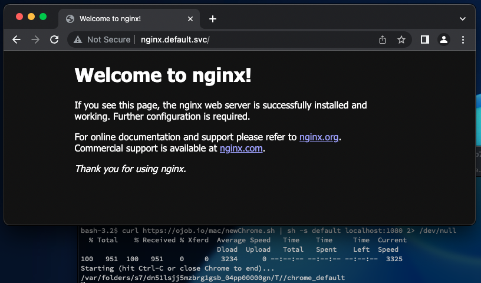
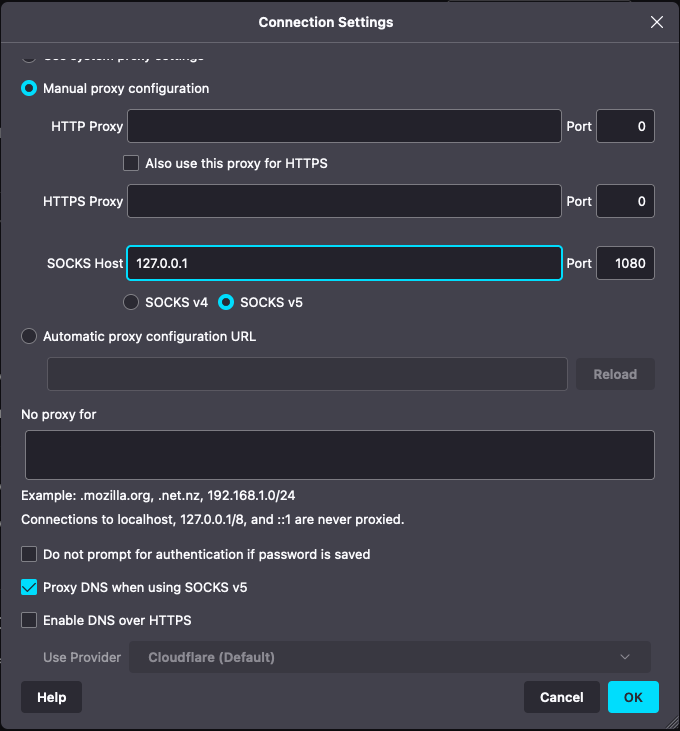
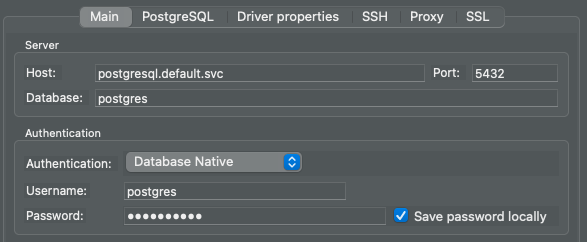
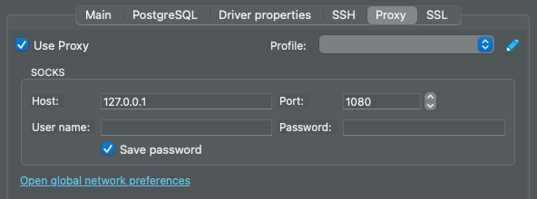
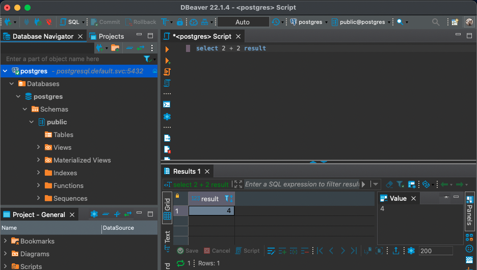

# socksd

Very simple SOCKS proxy container. Allows you to proxy directly to a docker network or a Kubernetes cluster connecting a curl command, your Chrome or Firefox browser or even other applications like DBeaver to access a database.

Main features:
- IPv6 support
- JSON logs output support
- SOCKS 4, 5 and 5 with DNS resolution
- Filter the network addresses allowed (e.g. 192.168.1.0/16,fc00::/7, etc...) 
- Detailed connection log support
- Scale capacity by increasing deploy replicas

## Run on Docker

````bash
docker run -d --rm -p 1080:1080 --network mynet --name socksd nmaguiar/socksd
````

And then configure your SOCKS proxy to localhost:1080

## Run on Kubernetes

````bash
kubectl create deployment socksd --image=nmaguiar/socksd --port=1080
kubectl port-forward deploy/socksd 1080:1080
````

And then configure your SOCKS proxy to localhost:1080

> You can avoid the port-forward by deploying a K8S NodePort service (e.g port 31080) to the socksd deployment. Please be aware that Istio will impact the connectinos to the socksd pod so it should be deployed in a non-Istio namespace.

## Building

Build command: 

````bash
docker build -t socksd .
````

## Options

You can control the behaviour with environment variables:

| Variable | Possible values | Description |
|----------|-----------------|-------------|
| ONLY_LOCAL | true/false | Filters all proxied traffic only to private network addresses |
| LOGS | true/false | Enables basic connection logging |
| LOGS_DETAIL | true/false | Enables more verbose logging (requires LOGS=true) |
| FILTERS | "192.168.1.0/16,fc00::/7" | Comma-delimited list of CIDRs to filter all traffic proxied. |
| OJOB_JSONLOG | true/false | Ensures all output log to stdout is in JSON |

> You can add these variables with the option '-e' on the ````docker run -d --rm -p 1080:1080 -e LOGS=true -e ONLY_LOCAL=true -e OJOB_JSONLOG=true --network mynet --name socksd nmaguiar/socksd```` command or with ````kubectl set env deploy socksd LOGS=true ONLY_LOCAL=true OJOB_JSONLOG=true```` in Kubernetes

## Examples

## Docker example

Creating a docker network, launching the socksd container and a nginx container and then "curl"ing directly the nginx container as if doing from another container:

````bash
docker network create test
docker run -d --rm -p 1080:1080 --network test --name socksd nmaguiar/socksd
docker run -d --rm -p 8888:80 --network test --name nginx nginx

# Curling inside the docker network 'test'
curl http://nginx --proxy socks5h://127.0.0.1:1080
````

## Kubernetes example

Launching a socksd deployment, a nginx deployment and exposing the nginx deployment. Then "curl"ing directly the nginx service as if it was running inside the Kubernetes cluster:

````bash
kubectl create deployment socksd --image nmaguiar/socksd --port=1080
kubectl create deployment nginx --image nginx

kubectl expose deploy nginx --port=80
kubectl port-forward deploy/socksd 1080:1080 &
# OR JUST: kubectl expose deploy socks-server --port=31080 --type=NodePort

# Curling inside the Kubernetes cluster
curl http://nginx.default.svc --proxy socks5h://127.0.0.1:1080
````

> Using the Kubernetes NodePort solution is faster than port-forward but requires that you have access to port 31080 on each node.

### Using browsers:

__Chrome__

You can run a Chrome browser in your desktop and enter URLs as if the browser was running inside the Kubernetes cluster:



To launch a separate clean Chrome browser configured to use a SOCKS proxy with proxy DNS you can use the following scripts on each OS:

| OS | Command |
|----|---------|
| Windows | curl https://ojob.io/win/newChrome.bat -O newChrome.bat<br>newChrome.bat default localhost:1080 |
| Mac OS | ````curl https://ojob.io/mac/newChrome.sh \| sh -s default localhost:1080```` |
| Linux | ````curl https://ojob.io/unix/newChrome.sh \| sh -s default localhost:1080```` |

> Use port 31080 instead of 1080 if you use the faster Kubernetes NodePort alternative

__Firefox__

Alternatively to Chrome based browsers you can configure Firefox by changing the connection settings for SOCKS proxy on a Firefox browser while also proxy DNS:



> Use port 31080 instead of 1080 if you use the faster Kubernetes NodePort alternative

## Kubernetes example with a database:

Launching a socksd deployment, a postgresql database deployment and then using DBeaver to access it:

````bash
kubectl create deployment socksd --image nmaguiar/socksd --port=1080
kubectl port-forward deploy/socksd 1080:1080 &
# OR kubectl expose deploy socks-server --port=31080 --type=NodePort

helm install postgresql bitnami/postgresql
echo PASSWORD=$(kubectl get secret --namespace default postgresql -o jsonpath="{.data.postgres-password}" | base64 -d)
````

Then, using DBeaver, create a PostgreSQL connection like this:



setting the proxy SOCKS like this:



> Use port 31080 instead of 1080 if you use the faster Kubernetes NodePort alternative

and you will be able to use the database directly as if you were running DBeaver inside the Kubernetes cluster:


